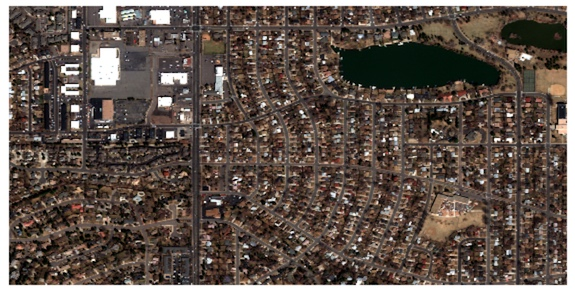

GBDXTools: Python tools for using GBDX
=======================================

GBDXTools is a package to simplify interaction with Maxars's GBDX platform and integrate GBDX data into
Python's mature analysis ecosystem. 

GBDX Platform
----------------

`GBDX <https://gbdxdocs.digitalglobe.com/>`_ is Maxar's online platform to access imagery, search data, and run analysis. Its functionality can be broken into four areas:

* Raster Data Access

    *Access to 100+ PB of Maxar satellite imagery plus Landsat, Sentinel, and other sources.*

* Image Catalog

    *Search and filter image metadata to find imagery.*

* Vector Services

    *Search and store vector data. Includes image footprints, OpenStreetMap, NaturalEarth, and other datasets.*

* GBDX Workflows

    *Build analysis workflows using a library of tasks and run them at scale.*

Python GBDXTools
--------------------

GBDXTools extends the access to these services with additional functionality for analysis and visualization. It can be thought of as having three layers:

* A core API library to abstract GBDX services

* Image classes that wrap all of the API calls, manage the geospatial metadata, and return NumPy arrays. These classes are based on `Dask <http://dask.pydata.org/>`_ arrays which defer the server calls until the image data is needed. 

* Simple visualization and analysis methods such as one-line plotting with Matplotlib (not included).

CLI RdaTools
----------------

Some GBDX functionality is also available through the command line with https://github.com/DigitalGlobe/rdatools. The CLI tool is useful for building simple workflows with other command lines tools like gdal_translate or JQ. RdaTools is a statically linked Go executable and binaries should run on most systems.

Example
---------------------

To load a subset of an image covering the Denver area using its catalog identifier, and view it in a Jupyter notebook:

.. code-block:: python

    from gbdxtools import CatalogImage
    image = CatalogImage('103001007B9DD400', bbox=[-105.06, 39.67, -105.04, 39.68])
    image.plot()

GBDXTools is MIT licenced.

The recommended installation method is with Anaconda::

    conda install -c conda-forge -c digitalglobe gbdxtools

GBDXTools can also be installed with pip::

    pip install gbdxtools

* GBDXTools github repository: https://github.com/DigitalGlobe/gbdxtools
* For general information on the GBDX platform and API visit http://gbdxdocs.digitalglobe.com.
* For a varied collection of gbdxtools examples see http://github.com/platformstories/notebooks.

Contents
------------
.. toctree::
   :maxdepth: 2

   user_guide
   imagery_access
   catalog_search
   vector_service
   vector_maps
   running_workflows
   api_reference
