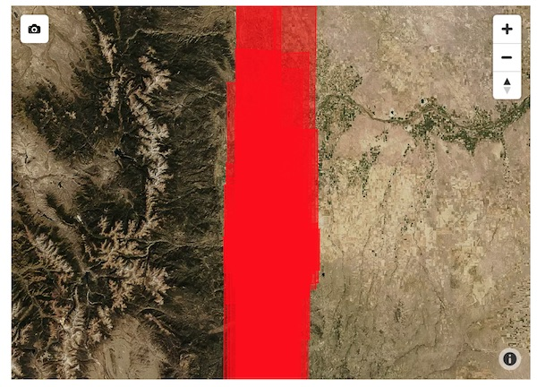

Vector Maps
==============

``gbdxtools`` provides the ability to view MapBox GL interactive maps in IPython and Jupyter.
These maps can include vector features and images. Vector features can be loaded from Vector Services queries, the geometry of images (via the __geo_interface) or could be the output of an analytical step.

The vector map styles mirror their matching Mapbox GL styles - for more information see the `MapBox GL Style Specification <https://www.mapbox.com/mapbox-gl-js/style-spec/>`_.

Vector Mapping Basics
------------------------

This example shows the basic use of ``gbdx.vectors.map()`` to display 100 DigitalGlobe aquisition footprints. 

By default, basic styles are already defined for points, lines, and polygons, so you can add mixed features to the map without having to define any styles.

.. code-block:: python

    from gbdxtools import Interface
    from shapely.geometry import box
    gbdx = Interface()
    
    bbox = [-105.038, 39.692, -104.914, 39.781]
    query = 'item_type:DigitalGlobeAcquisition'
    sensor_features = gbdx.vectors.query(box(*bbox).wkt, query, count=100)
    
    # copy the sensor data to a more convenient location
    for f in sensor_features:
        f['properties']['sensor'] = f['properties']['item_type'][3]
    
    gbdx.vectors.map(features=sensor_features, zoom=7)

Modifying Styles
------------------
   
To change the styling from the defaults you can pass in properties like
``color`` and ``opacity`` parameters to the map call. For most styling
parameters, you can pass in simple values (e.g. HTML color
names or hex strings for color properties).

.. code-block:: python

    gbdx.vectors.map(features=sensor_features, color='#905bFF', opacity=.1, zoom=7)

To apply different styling to different geometry types ``gbdxtools`` provides specific style classes: 

- ``CircleStyle`` to style things as points
- ``LineStyle`` to style things as lines, including polygon outlines
- ``FillStyle`` to style polygons

To see the styles types, lets apply them to OSM data that mixes points, lines, and
polygons. First we'll create a map using the default styling:

.. code-block:: python

    aoi = box(-97.803125,30.230669,-97.667427,30.306355).buffer(-0.03)
    osm_data = gbdx.vectors.query(aoi.wkt, query="ingest_source:OSM", index="vector-osm-*", count=2000)
    
    # we're adding 'radius' so point data shows up more easily
    gbdx.vectors.map(features=osm_data, zoom=14, radius=5)

.. image :: ./images/vector_maps_radius_style.jpg

To change the point feature styling to use circles, we can apply a ``CircleStyle`` to the map:

.. code-block:: python

    from gbdxtools import CircleStyle
    
    style = CircleStyle(radius=4, color='aqua')
    
    gbdx.vectors.map(features=osm_data, zoom=14, styles=style)

.. image :: ./images/vector_maps_circle_style.jpg

Next, we can add line styling and modify the colors:

.. code-block:: python

    from gbdxtools import LineStyle, CircleStyle
    
    circle = CircleStyle(color='#0ffff0', radius=3, opacity=.75)
    line = LineStyle(color='#0035ff', opacity=.75, width=3)  # note: line styling will also apply to polygon outlines
    
    gbdx.vectors.map(features=osm_data, zoom=14, styles=[line, circle])

.. image :: ./images/vector_maps_circle_line_styles.jpg

Finally, we can style the polygons by supplying a fill style:

.. code-block:: python

    from gbdxtools import LineStyle, CircleStyle, FillStyle
    
    circle = CircleStyle(color='#0ffff0', radius=3, opacity=.75)
    line = LineStyle(color='#0035ff', opacity=.75, width=3)  # note: line styling will also apply to polygon outlines
    fill = FillStyle(color='olive', opacity=0.5)
    
    gbdx.vectors.map(features=osm_data, zoom=14, styles=[line, circle, fill])

.. image :: ./images/vector_maps_all_styles.jpg

Data-driven Styling
----------------------

For advanced visualization ``gbdxtools`` can style features based on
their properties. For example, if you wanted to to style based on categorical 
data, you could use a ``MatchExpression``:

.. code-block:: python

    from gbdxtools import MatchExpression, FillStyle
    
    color = MatchExpression(
        property_name='sensor', 
        values={'WV03_SWIR': 'aqua',
                'WV03_VNIR': 'olive',
                'WV04': 'blue',
                'WV02': 'orange',
                'WV01': 'yellow',
                'GE01': 'fuchsia'},
        default_value='#ff0000')
    
    gbdx.vectors.map(features=sensor_features, zoom=7, styles=FillStyle(color=color)) 

.. image :: ./images/vector_maps_match_expression.jpg

To style data grouped into bins based on a numerical property you can use a ``StepExpression``
that defines the breaks between groups.

.. code-block:: python

    import json
    from gbdxtools import FillStyle, StepExpression
    
    dataset_id = 'ebb12776-78f1-4188-8c38-6b83d52315b9'
    query = 'item_type:datapoint AND attributes.dataset_id:{}'.format(dataset_id)
    veda_features = gbdx.vectors.query(box(-180, -90, 180, 90).wkt, query, count=2000, index='vector-user-provided-veda-dev')
    
    for f in veda_features:
        f['properties']['count'] = 0
        for k, v in json.loads(f['properties']['attributes']['label_str']).items():
            f['properties']['count'] += len(v)
            
    fill_color = StepExpression(
        property_name='count',
        stops={
            0: '#F2F12D',
            5: '#EED322',
            7: '#E6B71E',
            10: '#DA9C20',
            25: '#CA8323',
            50: '#B86B25',
            75: '#A25626',
            100: '#8B4225',
            250: '#723122'
        })
    
    gbdx.vectors.map(features=veda_features, zoom=12, styles=FillStyle(color=fill_color))

.. image :: ./images/vector_maps_step_expression.jpg

For a smooth transition between steps the ``InterpolateExpression`` works in
a similar manner to the ``StepExpression`` and adds several methods for computing the 
gradients (see the MapBox docs for more details).

.. code-block:: python

    from gbdxtools import FillStyle, InterpolateExpression
    
    fill_color = InterpolateExpression(
        property_name='count',
        type=['linear'],
        stops={
            0: '#F2F12D',
            5: '#EED322',
            7: '#E6B71E',
            10: '#DA9C20',
            25: '#CA8323',
            50: '#B86B25',
            75: '#A25626',
            100: '#8B4225',
            250: '#723122'
        })
    
    gbdx.vectors.map(features=veda_features, zoom=12, styles=FillStyle(color=fill_color))

.. image :: ./images/vector_maps_interpolate_expression.jpg

Advanced Visualization
------------------------

`gbdxtools` vector styles also supports 3-D styling with the ``FillExtrusionStyle`` that can
be used in place of a regular ``FillStyle``.

.. code-block:: python

    from gbdxtools import FillExtrusionStyle
    
    f = FillExtrusionStyle(height=['get', 'count'], color=fill_color, base=0, opacity=.75)
    
    gbdx.vectors.map(features=veda_features, zoom=12, styles=f)

.. image :: ./images/vector_maps_extrusion.jpg

The ``FillExtrusionStyle`` can be used for data-driven visualizations. This example loads building data
from OSM and uses their height to draw their elevations, and colors each building by how tall it is.

.. code-block:: python

    aoi = box(-97.803125,30.230669,-97.667427,30.306355).buffer(-0.035)
    building_data = gbdx.vectors.query(aoi.wkt, 
                                  query="item_type:Building AND ingest_source:OSM AND attributes.building:yes", 
                                  index="vector-osm-*", 
                                  count=4000)
    with_height = []
    for f in building_data:
        if 'height' in f['properties']['attributes']:
            f['properties']['height'] = int(float(f['properties']['attributes']['height']) * 3)
            with_height.append(f)
            from gbdxtools import InterpolateExpression, FillExtrusionStyle
    
    color = InterpolateExpression(
        property_name='height',
        type=['linear'],
        stops={
            0: 'rgb(178,24,43)',
            5: 'rgb(214,96,77)',
            7: 'rgb(244,165,130)',
            10: 'rgb(253,219,199)',
            25: 'rgb(209,229,240)',
            50: 'rgb(146,197,222)',
            75: 'rgb(67,147,195)',
            100: 'rgb(33,102,172)'
        })
    
    style = FillExtrusionStyle(height=['get', 'height'], color=color, base=0, opacity=1)
    
    gbdx.vectors.map(features=with_height, zoom=15, styles=style)

.. image :: ./images/vector_maps_building_heights.jpg

The vector maps can also generate heat map visualizations using the ``HeatmapStyle``. In this case, we're
showing the concentration of buildings.

.. code-block:: python

    from gbdxtools import HeatmapStyle
    
    style = HeatmapStyle()
    
    gbdx.vectors.map(features=with_height, zoom=12, styles=style)

.. image :: ./images/vector_maps_heatmap.jpg

Heat maps can also take custom styling. This example applies different color ranges
based on the kernel density estimation for each pixel in the heatmap, styling the 
intensity and weight based on the zoom level.

.. code-block:: python

    from gbdxtools import HeatmapStyle, HeatmapExpression, ZoomExpression
    
    color = HeatmapExpression(
        type=['linear'],
        stops={
            0: "rgba(33,102,172,0)",
            0.4: "rgb(103,169,207)",
            0.5: "rgb(209,229,240)",
            0.8: "rgb(253,219,199)",
            0.9: "rgb(239,138,98)",
            1: "rgb(178,24,43)"
        })
    
    intensity = ZoomExpression(
        type=['linear'],
        stops=[0, 1, 9, 5, 12, 10])
    
    weight = ZoomExpression(
        type=['linear'],
        stops=[0, 0, 12, 10])
    
    
    style = HeatmapStyle(color=color, intensity=intensity, wieght=weight)
    
    gbdx.vectors.map(features=with_height, zoom=12, styles=style)

.. image :: ./images/vector_maps_heatmap_custom.jpg

To show imagery behind the vectors on your map, you can pass in the ``image`` parameter when
creating a map.

.. code-block:: python

    from gbdxtools import CatalogImage, RDAImage
    from gbdxtools.vectors import Vectors
    from shapely.geometry import shape
    import json
    
    with open('mlfeatures.json', 'r') as fh:
        ml_features = json.load(fh)
    
    cat_id = '1040010025821C00'
    bbox = [31.649343771860007, 9.545529125071429, 31.65160646662116, 9.547494820831552]
    image = CatalogImage(cat_id, pansharpen=True)
    aoi = image.aoi(bbox=bbox)
    
    vs = Vectors()
    vs.map(features=ml_features, zoom=17, color='yellow', image=aoi)

.. image :: ./images/vector_maps_image.jpg

You can apply bounds to the image:

.. code-block:: python

    vs.map(features=ml_features, zoom=17, color='pink', image=aoi.ndvi(), image_bounds=aoi.bounds)

.. image :: ./images/vector_maps_image_bounds.jpg

Saving Map Images
--------------------

At the top-left of the map is a small camera icon. Pressing this button will take a screenshot of
the map, allowing you to export a view of the map to a PNG file.

